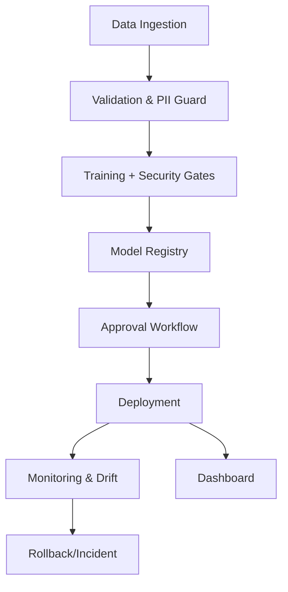

# Architecture Overview

## Components
- **Backend (FastAPI)**: Exposes training, approvals, deployment, prediction, SBOM scanning, rollback, metrics, and dashboard endpoints.
- **Data Validator**: Schema/PII/anomaly checks, data quality scoring, and dataset fingerprinting.
- **Trainer**: Sklearn logistic regression with adversarial robustness scoring, fairness proxy metrics, and metadata capture.
- **Model Registry**: Local JSON-backed registry with versioning, signatures, approvals, and rollback helper.
- **Container Builder**: Hardened Dockerfile generation, SBOM creation (CycloneDX), and dependency policy checks.
- **Monitoring**: PSI-based drift detection, adversarial alert logging, and governance events.
- **Frontend Dashboard**: Visualizes registry contents, metrics, drift snapshots, and SBOM links.

## Data & Control Flow
1. **Ingest**: `/train` receives records → validated (schema/PII/anomaly) → fingerprinted.
2. **Train**: Data split → model fit → metrics + adversarial/fairness scores → metadata persisted.
3. **Sign & Register**: Model saved and signed → registry updated with approvals defaulting to false.
4. **Approve**: Reviewer calls `/approve_model` → audit logs store decision.
5. **Deploy**: `/deploy` verifies signature + approval → activates latest model → baseline set for drift.
6. **Serve & Monitor**: `/predict` scores requests and computes PSI drift; alerts logged when threshold exceeded.
7. **SBOM & Supply Chain**: `/scan_sbom` emits Dockerfile + SBOM and highlights policy violations.
8. **Rollback**: `/rollback` reverts to prior model when drift/adversarial events are detected.

## Data Stores
- **Registry**: `models/registry.json`
- **Models**: `models/model_<run_id>.joblib`
- **Logs**: `logs/secure_mlops.log` (rotating)
- **SBOMs**: `sbom/sbom_<run_id>.json`

## Trust Boundaries & Security Notes
- Input validation and strict schemas on all endpoints.
- Models are signed and verified pre-deployment; rollback protects against tampering or drift.
- Containers default to non-root and minimal image; dependencies visible via SBOM.
- Audit logging provides traceability for approvals, drift alerts, and deployments.
